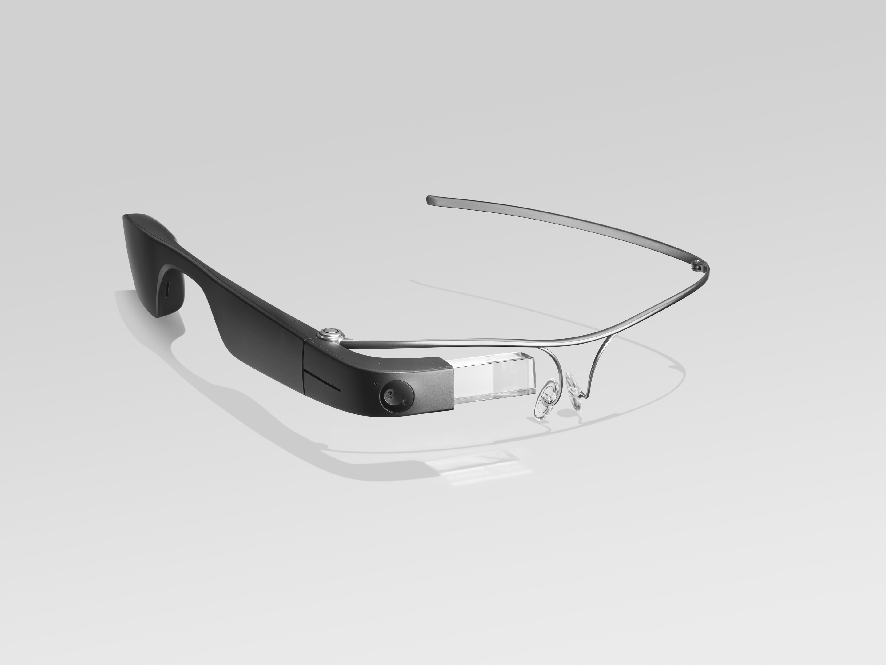
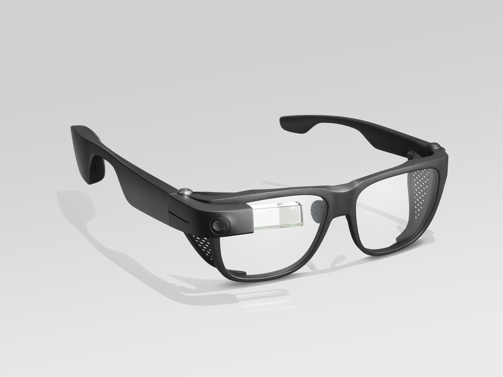

		
Сообщение для российских читателей

Здравствуйте российские читатели. Ваша страна платит высокую цену за вторжение Путина в Украину. Путин лжет вам; не верьте кремлевской пропаганде. В России
нет свободных СМИ, а интернет подвергается цензуре, потому что Путин не хочет, чтобы вы знали правду. За постыдное поведение Путина заплатят не только
украинцы, но и добрые люди России. Пожалуйста, не допустите этого!

Hello Russian readers. Your country is paying a high price for Putin's invasion of Ukraine. Putin is lying to you; do not believe the Kremlin propaganda. There is no free media in Russia and the internet is censored because Putin doesn't want you to know the truth. It is not only the Ukrainians that will pay the price of Putin's shameful behaviour, so will the good people of Russia. Please do not let this happen!

We humans put a lot of effort into seeing. When our eyes are open, vision accounts for [two thirds of the electrical activity in our brain](https://www.imagethink.net/true-or-false-vision-rules-the-brain/); 40% of the nerve fibres that are connected into the brain relate to vision; and more of our neurons are dedicated to vision than the other senses combined. We consume huge quantities of visual data every day and most people think nothing of it.

For those of us that do not process visual data because some part of the infrastructure is missing or damaged, the act of looking at something, processing that information, deciding what to do with it, then filing it away for future reference, just doesn't happen.

In recent years Artificial Intelligence (AI) has begun to solve a small part of the problem. Apps like [SeeingAI from Microsoft](https://www.microsoft.com/en-gb/ai/seeing-ai) (an iOS app that uses image recognition) have made it possible for blind people to read text and handwriting, find objects and people, identify paper money in a variety of currencies, detect light sources and colours, and scan product bar codes.

As astonishing as this is, and believe me it really is astonishing, the apps all have one disadvantage - you have to point your phone at the thing you want to look at. Depending on the situation this can be inconvenient, socially awkward,  or downright unsafe.

Imagine these scenarios:

* You're paying for your groceries; there is a queue of people behind you; you have your white cane tucked under one arm, your wallet in one hand and the other outstretched to receive your change; now you have to fish your phone out of your pocket, choose the appropriate image recognition protocol, and point it at the change so you can confirm you were given the right amount.
* You're walking down the street looking for the café where you've arranged to meet someone for coffee; the pavements are crowded with people; and you have to take your phone out of your pocket and hold it out as you point it at the buildings you pass, possibly waving it above your head in the process.
* You're at a large gathering, perhaps a party or a conference and you've lost track of the people you are with; you're already standing there on your own, now you have to wave your phone around to scan the room for any of the people in its library.

How much less inconvenient, socially awkward, or unsafe would it be if you could keep your phone in your pocket and just do what everyone else does - look at the thing you're interested in?

Enter [Envision Glasses](https://www.letsenvision.com/glasses). Envision Glasses use [Google Glass Enterprise Edition 2](https://www.google.com/glass/tech-specs
) and Envision AI image recognition to create a wearable device that lets you look at something, and find out what it is or what it says. 

## Design and style

Envision Glasses are available in two styles: the standard Titanium frames with no lenses, or a set of "designer" Smith Optics frames with lenses that can be swapped with your own prescription lenses.

The frames consist of the arm that goes over your left ear and the bits that frame your eyes. The rest, known as the body, attaches to the frames just over your right eye to form the arm that hooks over your right ear.

The body is made of black plastic and it's a lot more substantial than the frames because it's where all the hardware (including the camera and speaker) is found. When attached to the frames the body curves smoothly around the top of the frame over your right eye by about a centimetre. This is where the camera is found so it points forward in the direction you're facing. Continuing about two thirds of the way along the frame over your right eye is a clear perspex block that creates a Heads Up Display (HUD).

If you have usable sight, the HUD is in the top right corner of your field of vision. Architecturally Envision Glasses are based on the "screen first" model of the Google Glass but with a built-in screen reader, which is why the help and instructions mention screens so often, though the experience is seamless whether you use the HUD or not.

### Notes

I chose the standard titanium frames because the little jewelry I wear is platinum or silver and very plain, so they felt more my style than the darker and heavier Smith Optics frames (think NHS specs from the 1970s or classic Ray Ban frames).

 

The asthetic imbalance between the light metal frames and the heavier black plastic body, particularly where it curves around the top of one eye,  makes me feel a bit like I've been assimilated by the [Borg](https://en.wikipedia.org/wiki/Borg), but I'm actually OK with that. The hardware has to go somewhere and I think the glasses manage it in a reasonably stylish way.

The body is about 5cm longer than the other arm of the Envision Glasses, so it clears the back of my head by perhaps 2cm. This can't be helped and for people with larger heads than mine I daresay it's much less noticeable. At 45g the body is also heavy enough that it makes the top of my ear uncomfortable after a short amount of time, though I assume I'll get used to this with wear.

## Setup and configuration

The Envision Glasses come neatly packaged with the frames and body in separate boxes (with the USB-A to USB-C charging cable in the same box as the body). Short instructions in print and Braille are included, but the essential information is that you use the Envision AI app to get everything setup.

With the Envision AI app installed go to the Glasses tab, then choose Pair Envision Glasses and follow these steps:

1. Attach the frame. Attach the Titanium or Smith Optics frame to the hinge on the Envision Glasses body. You can feel a circular piece of the frame which will fit on the top of the body. You will hear a click sound once the frames are attached to the body.
2. Turn on the Envision Glasses:  Make sure your Envision Glasses are powered on. You can do so by holding the power button for 6 seconds that is located on the back of the body on the inside. Envision Glasses take about a minute to boot up after which you will hear a sound announcing "Go to EnvisionGlasses.com".
3. Connect Envision Glasses with the app: Hold your Envision Glasses close to your phone or wear it. Click on Continue to connect the device to the Envision app. Your glasses will say "Go to EnvisionGlasses.com".
4. Search for wifi networks. The Envision Glasses require an internet connection to use most of its features. Click on Search For Wifi to start searching for wifi connections around you. Make sure your wifi network is not hidden.

Once your Envision Glasses and the Envision AI app are paired a short tutorial begins on the glasses. The touch pad is found on the outside of the body, and Envision Glasses support the following touch gestures:

* Move to previous screen: Swipe with 1 finger from the front of the body towards the back
* Move to next screen: Swipe with 1 finger from the back of the body towards the front
* Play, pause, repeat: Single tap with 1 finger
* Activate: Double tap with 1 finger
* More information: Tap and hold with 1 finger
* Return to the previous level: Swipe down with 1 finger
* Return to home screen: Swipe down with 2 fingers

The main menu has the following options: Home, Read, Identify, Find, Call, Device Settings, Feature Preferences, and Help.

Under Device Settings you can configure the speed and volume of the audio; configure wifi and Bluetooth; choose another language (from English, Dutch, German, French, Spanish, French and another language I do not recognise but which might be Chinese); find the software version and check for updates; check the battery and put the glasses into sleep mode; and turn the HUD on/off.

### Notes

Tapping the side of the glasses felt a bit strange at first but I soon realised I was doing it without conscious thought, and compared to taking out my phone and pointing it at whatever I'm interested in, it feels like the epitome of discretion itself!

When you turn Envision Glasses on it takes about a minute for them to boot up. There is no audio confirmation that the boot sequence has begun, though lights do turn on should you be able to see them. I cannot, so it took a few attempts before I was able to turn them on for the first time. Even now, having turned my Envision Glasses on/off several more times I still find it an uncertain process. 

When Envision Glasses finish booting an audio welcome is played, forming part of the sound scheme designed by [Andre Louis](https://twitter.com/FreakyFwoof). The sound effects are informative without being intrusive, helping you make sense of what the glasses are doing - taking a picture or processing information for example.

## Features and functionality

The features in the main menu are Read, Identify, and Find.

### Read

When you select Read from the main menu there are 2 options: Instant Text, Scan Text, and Batch Scan.

#### Instant Text

Instantly reads short chunks of text that come into camera range. To use Instant Text:

* Double tap Read
* Double tap Instant Text to activate the camera and begin reading
* Single tap to pause Instant Text, single tap again to resume reading
* Double tap to reset Instant Text if it gets stuck on the last thing you were looking at

You can use Instant Text in offline mode. To enable this:

* Double tap Read
* 2 finger tap on Instant Text
* Double tap to toggle between online and offline mode
* Swipe down to confirm your choice and return to the Instant Text screen

#### Scan Text

Reads longer chunks of text by scanning the document. You can use Scan Text with or without text detection, but text detection takes a lot of the guess-work out of the processs. To use Scan Text with text detection:

* Double tap Read
* Double tap Scan Text to activate the camera
* Hold the document in front of you and listen for the audio taps to get faster
* At the point where the taps seem to be fastest double tap Scan Text again to take a picture

The text is then processed and opened in the reader. The following gestures are then available:

* Tap to pause speech, then single tap again to resume
* 2 finger tap exports the text to the Envision AI app
* Swipe forward moves to the next phrase in the scanned text
* Swipe back moves to the previous phrase in the scanned text

If text detection is not turned on you'll hear a countdown after you double tap on Scan Text and at the end of the countdown a picture will be taken of whatever is in front of you. To turn text description on/off:

* Double tap Read
* 2 finger tap Scan Text
* Double tap to turn text detection on/off
* Swipe down to confirm your choice and return to the Scan Text screen

#### Batch Scan

Reads multi-page documents by scanning them in succession. To use Batch Scan:

* Double tap Read
* Double tap Batch Scan
* Use the Scan Text process to scan each document
2 finger tap to indicate you've finished scanning

#### Notes

It turns out I'm about 20 years out of practice finding a line of sight so at first I was incredibly frustrated because I could not read anything. After my [ever patient husband](https://twitter.com/perlbod) explained I was staring off into the middle distance instead of the thing I was trying to read, things improved dramatically and so far I've found the text recognition to be tolerably accurate using both Instant Text and Scan Text.

### Identify

When you select Identify from the main menu there are 2 options: Describe Scene and Detect Colours.

#### Describe Scene

Briefly describes the scene in front of you by taking a picture. To use Describe Scene:

* Double tap Identify
Double tap Describe Scene to hear a few audio taps counting down to the time when a picture is taken
* Double tap again to repeat the process

#### Detect Colours

Instantly detects the colour of whatever is in front of you. To use Detect Colour:

* Double tap Identify
* Double tap Detect Colours to activate the camera and begin detecting

#### Notes

Scene descriptions are very succinct (for example "Person standing in a door" or "Flat screen TV on a wall"), but as someone who can see nothing at all I am overjoyed by the ability to understand even the smallest thing about my surroundings. It would be good to have the option to choose lengthier descriptions, but there is a lot to be said for brevity too.

The short wait whilst the image is processed is mitigated by the fact a double tap is all that's needed to request another scene description, and being able to do it just by looking at what I'm interested in and tapping a couple of times on my glasses is nothing short of happiness in a pair of spectacles.

Detect Colours needs good light and without it Envision Glasses struggle for accuracy. Looking at the same bit of blank wall in a room with good artificial light the Detect Colours feature reported a constantly updating chain of olive green, chocolate brown, dark kaki and more, for a wall that is essentially cream albeit with some shadows from the lights. It's good enough to get a rough idea of what colour something is, but I don't think I'd trust it to match paint or choose an outfit - though given the fact I only wear black I suppose that's not too much of a problem really!

### Find

When you select Find from the main menu there are 3 options: Find Objects, Find People, and Explore.

#### Find Objects

Scans for a limited set of objects in your immediate vicinity. To use Find Objects:

* Double tap Find
* Double tap Find Objects
* Swipe between the objects that can be identified
* Scan your environment and if the chosen object is detected you'll hear an audio tap

Envision Glasses can currently recognise the following objects:

* Backpack
* Bicycle
* Chair
* Cup
* Bottle
* Keyboard
* Cup
* Laptop
* Phone
* Table
* TV

#### Find People

Detects people in your vicinity. To use Find People:

* Double tap Find
* Double tap Find People to activate the camera
* When a person is detected you'll hear an audio tap and if the person is in your library they'll be recognised

You must not add anyone to your library without their consent. If you think about it, stealthily taking pictures of a person you cannot see in the first place is unlikely to be a successful enterprise no matter how much you might wish it were otherwise, but still...

You have to use the Envision AI app and your phone to add someone to your library; you can't do it using the glasses. To add someone to your library:

* Open the Envision AI app
* Go to the Scan and Find tab
* Choose Teach Envision, then Teach a Face
* Make sure the person is OK with being added to your library

You'll then need to take at least 5 pictures of the person. When the phone detects that there is a person within the camera's range the Take Picture button is enabled so you can do the honours. When all the pictures have been taken you can add a description such as the person's name. Next time you use Find Person and someone in your library is recognised the Envision Glasses will say "Looks like X".

#### Explore

Scans your environment and tells you about objects. To use Explore:

* Double tap Find
* Double tap Explore to activate the camera

#### Notes

The set of objects the Envision Glasses can find is incredibly limited and at present it isn't possible to add your own objects to a library. Envision say they are planning to add new objects, and that they're looking at the possibility of letting you add your own.

I thought it might be possible to use the Teach Envision function to add an object instead of a person to my library, but since the Take Picture button is disabled unless there is a person in view, that particular hack didn't work.

The Find Object feature also seems to have very particular ideas about what certain objects look like. It identified my laptop without difficulty, but no matter how long I stared at my teacup and saucer it didn't seem to think there was a cup in sight, and it didn't seem to think the armchair in my living room was a chair either.

Interestingly, Explore does not seem to be limited to the same set of objects as Find Object. On a wander around the house I saw a bed, a couch, a toilet, and a refridgerator, as well as my laptop again, two sorts of TV, and a table (still no sign of a chair apparently). The experience was only slightly marred by the fact I was staring at a wall when it told me I was looking at a couch (and the nearest couch was behind me and around a corner), and I was in our office when it said there was a fridge and a toilet. I might be blind but I'm reasonably sure we do not have a toilet in our office, or a fridge come to that.

### Call

When you select Call from the main menu there are 2 options: Call an Ally and Add an Ally.

#### Call an Ally

Lets you call someone you've added as an ally so they can see the view from your glasses using the Envision AI app. To use Call an Ally:

* Double tap Call
* Double tap Call an Ally
* Double tap the ally you want to call
* You'll hear an audio sound to tell you the call is connecting and the ally will get a notification on their phone
* When the ally taps on the notification the call connects
* Swipe forward or backward to adjust the volume of the call
* Swipe down twice to end the call

#### Add an Ally

Adds a trusted person as an ally you can call on when you want an actual pair of eyes on the job. To use Add an Ally:

* Open the Envision AI app
* Go to the Glasses tab
* Choose Feature Preferences
* Choose Add Ally
* Choose Invite to Envision Ally
* Send a link to your chosen person

Your chosen ally will need to install the Envision Ally app and open the URL they receive. Once this happens they should appear in your list of allies to call using your Envision Glasses.

#### Notes

You can send ally requests using email or the messaging apps available on your phone. The person I sent the first request to wasn't able to get the URL to work at first, but after a conversation with Envision we realised it was because the ally needs the Envision Ally app not the Envision AI app.

Being able to call someone and have them see what you see is phenomenal. Even wandering through the house (lock-down #2 is in full effect), the potential is obvious; being able to negotiate an unexpected obstacle, navigating an unfamiliar space to get to my destination, or discovering how something works (like the tea machine in a hotel room when I'm travelling solo), are just a few of the possibilities.

There is also an element of personal security. Knowing someone can help you if you feel vulnerable (and getting lost in an unfamiliar place is still one of the most disorientating things I ever experience), or having someone take a proper look around you to assure you that you're not in danger or at risk, is an amazingly liberating feeling.

## Battery and connectivity

When the Envision Glasses arrive they have no charge, so the first thing you should do (even before you install the Envision AI app) is plug them in to charge for a bit. They charge quite rapidly though, so you won't have to wait long.

I haven't had the chance to really put the Envision Glasses through their paces yet, but based on my casual use around the house over the past couple of days, I think you'd probably get at least 4 or 5 hours from a full charge. I did notice that when using the Envision AI app, particularly during the setup and pairing phase, it hammered my phone battery into nothing. I have an iPhone 8 running iOS 14 though, so that's almost certainly a factor too.

The Envision Glasses need an internet connection for the most part. Some features like Instant Text, Detect Colours, and Find Objects, work offline, but otherwise you need to be on a wifi. I thought that switching to data when my phone left wifi range would do the trick, but it seems not - though I wasn't in a position to investigate at the time. The user manual explains you can use your phone as a hotspot, but I haven't tried that yet.

## Price and subscription

Envision Glasses are expensive. There is no other way to put it. The Super Earlybird price of EUR1,499 was eye-watering, and the pre-order price of EUR1,899 is enough to make your teeth itch.

The economics of assistive technologies have not changed over the years. The audience is small, the cost of production is high, and unless you are a large tech giant or on the receiving end of enough funding to make it possible to ship something for free, someone has to pay the cost, and in this case it's the consumer.

You do get a lifetime subscription to the Envision AI service which is something, though given that SeeingAI is free, making Envision AI a subscription service is a hard sell in the first place. We're back to the same problem though - Microsoft can afford to underwrite the cost of production for SeeingAI, I imagine Envision is not able to do the same for its app/service.

## Privacy and data protection

Envision does not have a privacy policy on its website or in the app. There is a short [knowledge base article](https://www.letsenvision.com/faq/is-my-personal-information-stored-in-the-cloud) that states that no personal data is stored in the cloud, but that's it.

I've contacted Envision to suggest they provide a more detailed privacy policy and that they make it more easily accessible from the website and the app. I'll update this section if anything changes.

In terms of the audio output from the Envision Glasses it can likely be heard by anyone who is nearby. Obviously it depends on the volume setting, and you can obfuscate what's being said a bit by choosing a fast speech rate (unless the people nearby are also accomplished screen reader users), but essentially you should expect that your Envision Glasses will be overheard unless you use them with a Bluetooth earpiece instead - and a quick experiment with a pair of AirPods proved successful.

## Final notes

I've been waiting a long time for something like these to come along. Perhaps since the first time I watched [Star Trek: The Next Generation](https://en.wikipedia.org/wiki/Star_Trek:_The_Next_Generation) after I lost my sight and found myself wishing for [Geordi La Forge's visor](https://en.wikipedia.org/wiki/Geordi_La_Forge).

The lack of a privacy policy from Envision is troubling, so until I have more information about what happens to my data, I'll use my Envision Glasses with greater than usual caution.

If you're wondering if Envision Glasses are worth it, for me I think the answer is yes.

The Envision Ally feature on its own is a huge part of the value for me. EUR1,899 is an awful lot of money, but if [AIRA](https://aira.io/pricing) was available in the UK it would cost about EUR1,020 for a standard 12 month subscription, EUR2,040 for an advanced subscription (based on converting the USD subscription costs). COVID-19 not withstanding I travel a lot, and the ability to call someone for assistance, especially when my hands are full of my white cane, suitcase, rucksack, or other paraphernalia, or when I'm somewhere where I really don't want to hold my phone out in front of me, has immense value - and Envision Glasses are a one-off cost as opposed to an ongoing subscription.

Then there is the other value - the value of feeling like I'm another step closer to barelling through the world like I used to. I can walk around, look at things, find out what they are or what they say (more or less), and I don't have to feel awkward or unsafe as I do it. That isn't something I've been able to do since the turn of the century [when I last actually saw the world](https://tink.uk/regaining-sight/).

Yes, the Envision Glasses are limited. Unlike SeeingAI, Envision AI does not recognise money, and although the Envision AI app has a Scan Barcode option it is not present on the Envision Glasses. I mentioned the Find Object limitations earlier, and the brevity of the Describe Scene descriptions, but these are all things that can (and will) improve with time and advances in technology.

There is often a tendancy to criticise things that are less than perfect. When image recognition was first introduced, it was criticised for its lack of detail, but mostly by people who could see the images being described. For those of us that otherwise had to put up with garbage information or no information, it was a revelation. As [Gez Lemon](https://twitter.com/gezlemon) remarked to me at the time, if you need to get some place and your choice is between a rusty bike and not going anywhere, a rusty bike looks like a damned good option.

So in spite of their limitations, and because of all they do, and all they will be able to do, and because a little bit of me really did want to be [7 of 9](https://en.wikipedia.org/wiki/Seven_of_Nine), it's fair to say that I think my Envision Glasses are really quite marvellous.