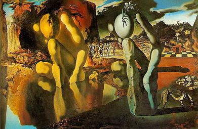

The provision of text alternatives has been a first principle of accessibility since before [WCAG 1.0](https://www.w3.org/TR/WCAG10/) made it official in 1999, but apparently not everyone has got the message. According to the [WebAIM Million from February 2020](https://webaim.org/projects/million/), more than 30% of homepage images were missing text descriptions and more than half of those images were part of links.

That is an awful lot of content that a blind person cannot see, understand, or use.

## When text descriptions are missing or unhelpful

If an image in an HTML document does not have a text description, which is to say if it is missing an `alt` attribute (or other attribute capable of giving it an accessible name like `aria-label` or `aria-labelledby`) the results are ugly. Different screen reader and browser combinations behave a little differently, but one common behaviour is to use the path to the image and/or the image file name instead.

Occaisionally the file name offers a tiny clue as to the content of the image but the days of human readable file names are largely gone and the majority of images now have non-sensical alpha-numeric strings as file names- and what "Image001.jpg" might contain is anyone's guess.

Even when there is a text description it isn't always helpful. The WebAIM Million further noted that just under 10% of images with text descriptions used descriptions that were effectively useless - things like "image", "blank", or even "filename.png".

## Machine learning features

In the absence of text descriptions provided by content authors, screen readers are turning to machine learning. Screen readers have used a form of machine learning called [Optical Character Recognition (OCR)](https://en.wikipedia.org/wiki/Optical_character_recognition) for some time. OCR examines a graphical representation of a document (like a scan of a paper document) for text content, then converts it into actual text that screen reader users can read. More recently screen readers have begun introducing [image recognition](https://en.wikipedia.org/wiki/Computer_vision#Recognition) capabilities. VoiceOver on iOS uses image recognition to describe images and identify common objects like icons and buttons; Jaws Picture Smart describes images and controls sourced from files, websites and the clipboard; NVDA recognises objects and with addons can be further extended.

## Image recognition in practice

As Arthur C. Clarke put it: "Any sufficiently advanced technology is indistinguishable from magic", and image recognition certainly seems like magic at first. The fact that a screen reader can examine an image and make some educated guesses about what it contains has only been possible for a few years.

image recognition has been around since the 1960s but it is only relatively recently that advances in machine learning and cloud computing have made it possible to add image recognition capabilities to consumer products and services. An "educated guess" is about as good as it gets though, because machine learning systems are only as good as the data they're trained with - and in the case of image recognition which needs to be able to recognise anything that can be put into an image, we're still a long way from the accuracy of human recognition.

To help mitigate this, the Picture Smart feature in Jaws uses certainty qualifiers to describe the image recognition results. For example here are the results for this image of the Mona Lisa by Leonardo Da Vinci:

* Caption is Mona Lisa posing for a picture
* These tags describe the photo: Drawing, human face, painting, person, sketch, woman
* These tags probably describe the photo: Art, portrait, text

If I had not actually seen the Mona Lisa, I could be reasonably confident that it was a picture of a woman, most likely a portrait painting, but much less sure if it was a sketch or a drawing (assuming there is a difference at all). Not bad; not bad at all.

## Content authored text descriptions are still needed

If you're thinking to yourself that providing text descriptions is no longer something you need to bother with though - think again.

Here are the Picture Smart image recognition results for this image of The Metamorphosis of Narcissus by Salvador Dali:

* Caption is a painting of a person
* These tags describe the photo: Art, cartoon, drawing, text
* This tag probably describes the photo: Illustration
* This tag possibly describes the photo: Sketch

To borrow from Douglas Adams, it's almost, but not quite entirely nothing like it. Here is the description of the painting from [Wikipedia](https://en.wikipedia.org/wiki/Metamorphosis_of_Narcissus#Dal%C3%AD's_Interpretation):

> In Dalí's painting, he depicts the figure of Narcissus on the left side of the canvas crouched by a lake, with his head resting on his knee, and a stone hand clutching an egg mirroring the shape of his body on the right. From out of the cracked egg, a narcissus flower sprouts. In the mid-ground of the painting stand a group of Narcissus's rejected suitors. Among the mountains in the background rests a third Narcissus figure.

So here's the thing - image recognition in screen readers is a massive improvement over the absence of anything better, but it isn't better than a text description provided by a content author who knows exactly what's in the image, why its being used and the context its being used in.