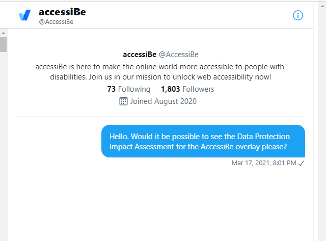

The [case for not using accessibility overlays](https://overlayfactsheet.com/) has been made and endorsed by industry professionals, disability organisations, and people with disabilities. One concern is the [privacy of personal data](https://overlayfactsheet.com/#privacy), and in the case of the [AccessiBe overlay](https://accessibe.com), it deserves closer scrutiny.

## Enhanced Tracking Protection (ETP)

I use Firefox with [Enhanced Tracking Protection (ETP)](https://support.mozilla.org/en-US/kb/enhanced-tracking-protection-firefox-desktop) enabled. This is how Mozilla describes ETP:

>Enhanced Tracking Protection in Firefox automatically protects your privacy while you browse. It blocks trackers that follow you around online to collect information about your browsing habits and interests... It also includes protections against harmful scripts...

This is the browser I used when I visited the AccessiBe website to find out more about their accessibility overlay and how it works.

Except the AccessiBe overlay didn't work because it was blocked by the ETP.

## Screen reader detection

When I turned off ETP and tried again, I found that the AccessiBe overlay automatically detected my screen reader and preselected a configuration based on that information.

I wrote about my [thoughts on screen reader detection](/thoughts-on-screen-reader-detection) in 2014. Now, I wanted to understand the full impact screen reader detection could have on my personal privacy.

## Third party Javascript

When the AccessiBe overlay is opened, the JavaScript it uses sets up local storage, session storage, and cookies from accounts.accessibe.com, although no persistent data seems to be stored in them. In other words, AccessiBe does not appear to use cookies or web storage for tracking (no matter if you use an assistive technology or not).

But...

The JavaScript that provides the AccessiBe overlay is loaded directly from AccessiBe's servers. This is what's known as third party JavaScript.

Third party JavaScripts, especially those that are added by web managers outside of the development lifecycle, can pose a [security risk](https://snyk.io/blog/third-party-javascript-concerns/). They can also be used to track you as you browse different websites.

## AccessiBe's privacy policy

Having realised that the AccessiBe overlay is a third party JavaScript that could be used to track my browsing activity, I looked at the [AccessiBe privacy policy](http://web.archive.org/web/20210718152701/https://accessibe.com/privacy-policy). Here's what it says about the information it collects from the websites you visit that use the AccessiBe overlay:

>When a website implements the AccessiBe Solution, it sends the following data to our servers: Image URLs, link URLs, HTML structure, CSS attributes, clicks, interactions, and pages viewed.

So, in addition to knowing you visited the website, AccessiBe also knows which pages you visited, and what you clicked on or otherwise interacted with whilst you were there. 

It goes on to say:

>This information does not include, actual content/text from the webpage or form or field information.

The interesting word there is `actual`. AccessiBe may not collect `actual content`, but (according to the [AccessiBe homepage](https://web.archive.org/web/20210718152033/https://accessibe.com/):

>AccessiBe uses contextual understanding and image recognition to scan and analyze the functionality of every element on your website...

So it might not collect the `actual content` from the website, but it says nothing about the data it collects by scanning the content and images.

The privacy policy goes on to say:

>In addition, the foregoing information does not include any Personal Information of any user and cannot be associated with any user.

This seems reassuring; until you remember that it only relates to the information AccessiBe collects from the website you visited. It does not cover the information AccessiBe collects about you:

>Our servers automatically collect information when you access or use the Website and record it in log files. The log information we collect may include your IP Address, the address of the web page visited before using the Website, browser type and settings, and cookie data.

Unless you use a Virtual Private Network (VPN), the [geolocation of your IP address](https://www.iplocation.net/) can be used to determine roughly where you were in the world when you visited the site with the AccessiBe overlay enabled, as well as the internet service provider you were using at the time. It's likely that your IP address is shared by the other devices on your network, and so does not identify your device specifically, but it is another piece of information that can be used to profile you.

When you follow a link, your browser keeps note of the web page you were on at the time, and makes the URL available to the website you're navigating to in the HTTP referrer. This information can help website owners learn more about the paths people take to reach their content (from search engines or from competitor websites for example), but AccessiBe does not own the websites that use its overlay.

Your `browser type and settings` create your `browser fingerprint`. Like its name suggests, your browser fingerprint is like your actual fingerprint. Whenever you touch something you leave behind a fingerprint. If someone knows what your fingerprint looks like, they can track the places you've visited by matching your fingerprints to those found at different locations.

Your browser fingerprint includes information about the time zone you're in, the language you're using, the browser you're using (including the plugins you have enabled), your operating system, the device you're using, your screen resolution, and more besides.

You might think that millions of other people have the same browser type and settings as you, but according to the [Electronic Freedom Foundation (PDF, 419Kb)](https://panopticlick.eff.org/static/browser-uniqueness.pdf), your browser fingerprint is shared by 1 in every 287,777 people.

The [population of Bristol](https://web.archive.org/web/20210629185008/https://www.bristol.gov.uk/statistics-census-information/the-population-of-bristol), the region identified by my IP address, is currently 465,900. That means there is 0.6 of another person somewhere in the area with the same browser fingerprint as me.

Now remember that as well as my IP address and browser fingerprint, AccessiBe also knows I use a screen reader, which, statistically speaking, means I'm blind or have extremely low vision.

None of this information identifies me as Léonie Watson, but it does identify me as a unique individual that AccessiBe can track across the websites that use the AccessiBe overlay.

Except that the AccessiBe privacy policy also says:

>We may collect information about you from other sources that may include your Personal Information. sources... such as third-party payment processors and social media services... publicly available sources; and marketing service providers...
>We may combine the information collected from third parties as set forth above with other information which is in our possession.

So there it is. Not only can AccessiBe identify me as a unique individual with a disability, they can also associate that information with my name, and any other information they can obtain from LinkedIn, Twitter, and other public sources.

## Data Protection Impact Assessment (DPIA)

According to the [Information Commissioner's Office (ICO)](https://ico.org.uk/for-organisations/guide-to-data-protection/guide-to-the-general-data-protection-regulation-gdpr/accountability-and-governance/data-protection-impact-assessments/):

>A Data Protection Impact Assessment (DPIA) is a process to help you identify and minimise the data protection risks of a project.
>You must do a DPIA for processing that is likely to result in a high risk to individuals.

AccessiBe's privacy policy makes me think there is a high risk to individuals, so I wanted to know what due diligence they'd carried out, and what ethical and legal basis they had to justify the risk.

On 17 March 2021, I sent AccessiBe a Direct Message (DM) on Twitter, asking them for a copy of their DPIA:

When AccessiBe did not respond, I completed the contact form on their website on 23 March. I was promptly called by one of their sales team, who could not tell me anything about AccessiBe's compliance with the General Data Protection Regulations (GDPR), but assured me someone would be in touch who could help.

When they had not responded by 1 April, I sent [AccessiBe an open tweet](https://twitter.com/LeonieWatson/status/1377596545168719876) asking them for a copy of their DPIA.

I'm still waiting.

If you choose not to risk letting AccessiBe have access to your personal data:

* Use a VPN like [Mozilla VPN](https://www.mozilla.org/en-US/products/vpn/) or  [Tunnel Bear](https://www.tunnelbear.com/)
* Use a blocker like Better (for Safari) or [AccessiByeBye](https://www.accessibyebye.org/) (for Chrome, edge, and Firefox), or one of the other solutions on the [AccessiBe Gone](https://sclower.github.io/accessibegone/)

With thanks to Laura Kalbag for help uncovering what the AccessiBe JavaScript does; to Heather Burns for help understanding GDPR policy; and to Christine Runnegar for helping me learn more about privacy in general.