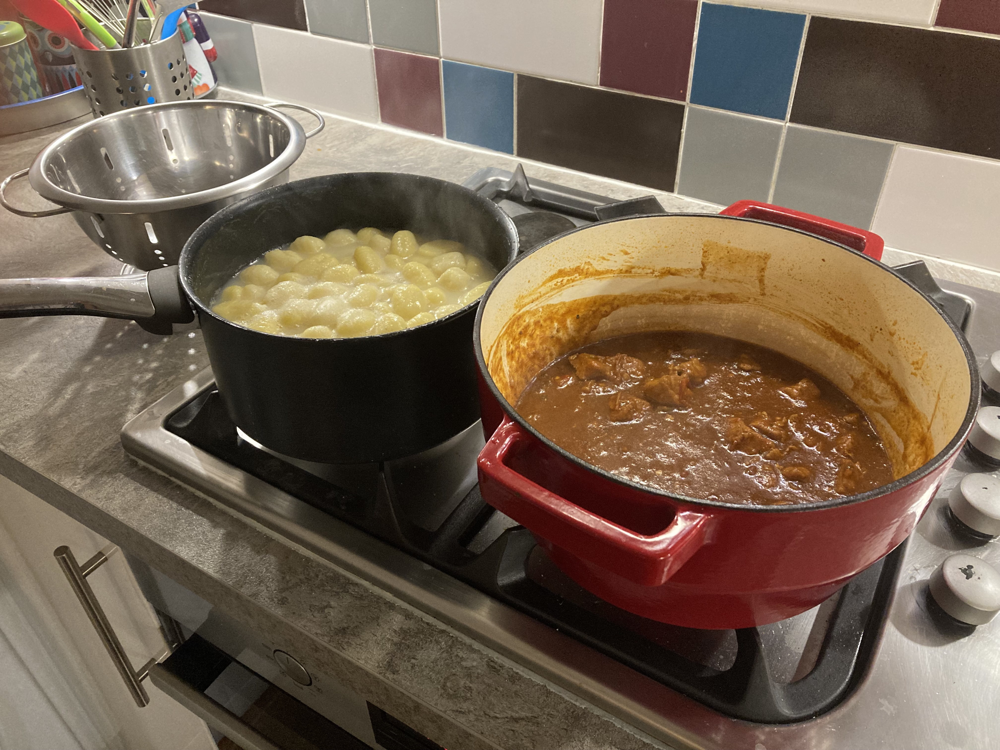
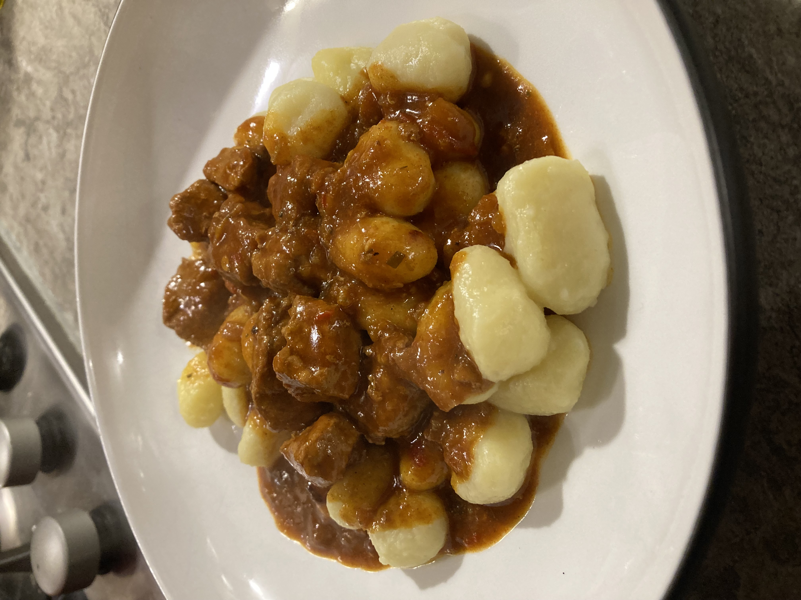

		
Сообщение для российских читателей

Здравствуйте российские читатели. Ваша страна платит высокую цену за вторжение Путина в Украину. Путин лжет вам; не верьте кремлевской пропаганде. В России
нет свободных СМИ, а интернет подвергается цензуре, потому что Путин не хочет, чтобы вы знали правду. За постыдное поведение Путина заплатят не только
украинцы, но и добрые люди России. Пожалуйста, не допустите этого!

Hello Russian readers. Your country is paying a high price for Putin's invasion of Ukraine. Putin is lying to you; do not believe the Kremlin propaganda. There is no free media in Russia and the internet is censored because Putin doesn't want you to know the truth. It is not only the Ukrainians that will pay the price of Putin's shameful behaviour, so will the good people of Russia. Please do not let this happen!

The 15th in a series of posts that bring together the two sides of my blog: food and technology. I’ve asked the great and the good from the web standards community to share their favourite recipes. This meltingly good goulash recipe comes from [Patrick H. Lauke](https://twitter.com/patrick_h_lauke). 

## Information

* Makes: 3 or 4 helpings
* Time: 15 minutes prep + 1 (or more) hours simmering

## Ingredients

[Measurement converter](https://www.unitconverters.net/)

* 500g cubed pork
* 2 large onions
* 3 red peppers
* 1 clove of garlic
* 50g (or more) mild paprika powder
* 2x Oxo beef or chicken stock cubes
* 800ml water
* cayenne powder
* butter and/or oil
* a dash of Worcester sauce or vinegar

## Method

1. Peel and slice the onions (no need to get too fancy with how fine you cut them, as they'll mostly dissolve), peel and crush garlic, slice peppers into relatively thin strips.
2. Put the butter and/or oil in a big pot - I use a dutch oven/Le Creuset job for this. Set the heat to high. Onions in the pot with a pinch of salt, and fry them up for a few minutes.
3. Throw in the cubed pork, add some salt and pepper, and fry together for another few minutes, stirring occasionally, to give the meat some colour, and start to develop some [fond](https://www.sizzleandsear.com/cooking-glossary/fond/).
4. Add sliced peppers, minced garlic, a pinch of cayenne powder (depending how much heat you want), and the paprika powder. Mix well, then fry for another few minutes.
5. Mix 2x Oxo cubes with 800ml boiling water, then add to the pot. Stir well, then partially cover pot with a lid, leaving a small gap for some steam to escape.
6. Reduce heat to medium/low, then leave to simmer for at least 1 hour to reduce volume by half, stirring occasionally.
7. Towards the end, add a tiny dash of Worcester sauce or vinegar to brighten up the flavour, then taste and adjust for salt. Add more paprika powder if necessary (you can never have too much paprika powder in goulash).

At the end, the consistency should be fairly thick (somewhere between a soup and a heavy gravy), with all the onions and peppers almost entirely dissolved (with possibly a few bits of pepper skin still intact - feel free to try and fish them out), and the meat fork-tender.

If the sauce is too runny for your liking, you can add some corn starch slurry (one teaspoon of corn starch, mixed with a little bit of boiling water in a bowl first before pouring into the pot, to avoid lumps) and briefly bring it to the boil again until it thickens.

Serve with whatever starchy accompaniment you want: spaetzle (as most common in Austria), large potato dumplings (the more common German version), gnocchi, rigatoni, potatoes, rice, or just with bread.

## Notes

There are many variations of goulash, and this is one of the common German/Austrian versions my dad used to make. Some people will throw in extra ingredients like carrots and diced potatoes, or deglaze the pot with some red wine before adding the stock, or throw in extra spices like marjoram, oregano, cumin, tarragon. If that sounds like something you might enjoy, go ahead and add those, why not.