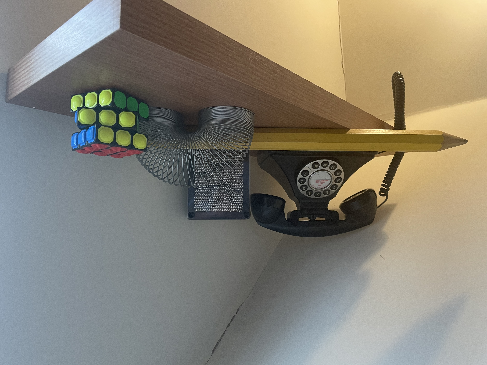

Today I was given early access to the [BeMyAI](https://www.bemyeyes.com/blog/introducing-be-my-eyes-virtual-volunteer) beta, a feature that's being added to the [BeMyEyes](https://www.bemyeyes.com/) iOS app using ChatGPT4.

## BeMyEyes

BeMyEyes is one of the most remarkable apps to have emerged in recent years. You sign up either as a [sighted volunteer](https://support.bemyeyes.com/hc/en-us/categories/360000920938-Sighted-Volunteer), or a blind or low vision person. If, like me, you fall into the latter category, you can then borrow a pair of eyes from a randomly selected volunteer.

The app is smart enough to connect you with a volunteer who speaks your language, and for whom it is daytime when you make your request. This is especially useful when you're somewhere that makes it inconvenient to call someone you usually would for help like this - because it's the middle of the night for them for example.

I've used it to remind me of settings on my stove, to figure out air-con controls in hotel rooms, to check the results of a rapid COVID test, and much more besides.

Although the anonimity of both participants is preserved, there are times when asking a stranger for help isn't convenient or comfortable. This is where BeMyAI comes in.

## BeMyAI

You can take a picture from inside the BeMyEyes app or upload one from elsewhere on your phone. With help from ChatGPT4 you get a detailed description of the image presented as text, which VoiceOver reads automatically. So far at least, this isn't anything that other apps like [SeeingAI](https://www.microsoft.com/en-us/ai/seeing-ai) don't offer. But here's the thing - you can talk to this just like you would one of the sighted volunteers.

Well, sort of.

For the moment you have to type or dictate your questions into a text box and submit them. In time it would be good if this feature could be made conversational, but this is an early beta, so it is what it is.

When I posted on the socials that I was experimenting with BeMyAI, people were curious about its accuracy - not surprising given its purpose and the fact that ChatGPT is, well, shall we say somewhat badly educated?

So I took a photo of a bit of my office that I know very well. I've owned most of the things in the picture since before I [lost my sight](/losing-sight), and I'm very familiar with the rest because it's my house after all.

Here's the initial description:

>The picture shows a wooden shelf attached to a wall. On the shelf, there are three items from left to right; an old fashioned rotary telephone, a metal slinky, and a Rubik's cube. The telephone is beige with a black rotary dial and a coiled cord, the metal slinky is in its classic coiled position, the Rubik's cube is colourful with different colours on each side including green, yellow, and red.
>
>The wall behind the shelf is painted in a light colour and the shelf is illuminated by a light source from above.

Not bad. Not entirely accurate either though. The telephone isn't beige, it's entirely black.

I asked BeMyAI:

>Are you sure the telephone is beige?

It replied with:

>Yes, I apologise for any confusion. The telephone is indeed beige in colour with a black rotary dial, and a coiled cord connecting the handset to the base.

Then there's the enormous yellow pencil. It's on the shelf between the telephone and the slinky.

So I asked:

>Can you describe the pencil?

And received the reply:

>I apologise, but there is no pencil visible in the picture you provided. The picture shows a rotary telephone, a metal slinky, and a Rubik's cube on a wooden shelf. If there is another picture with a pencil in it you would like me to describe, please upload it and I'd be happy to help.

The information I received along with access to the early beta had this to say:

>Our AI pioneers have observed that sometimes AI will tell you some things are in the picture when they are not, or it will omit things that are (these are called hallucinations). That’s why at this early stage we urge you to follow a few simple safety guidelines...

Fair enough. You'd be surprised by how much stuff a sighted person doesn't pay attention to, or at least think it worthy of commenting on, so I'm not holding BeMyAI to a particularly high standard just yet.

A lovely feature of humans is that you can ask them questions when you want more information, and those questions can be quite abstract. Sometimes though it might not be convenient to - with BeMyEyes you're always slightly conscious that some kind person has given up a few moments of their time to help, and you don't want to presume too much on their time. Or at least I do. Others may feel differently of course.
 
Either way, it's the ability to question BeMyAI that makes this particularly interesting. So I asked:

>What is the biggest item on the shelf?

It told me:

>The biggest item on the shelf is the old fashioned rotary telephone. It takes more space than the metal slinky and the Rubik's cube.

Alright:

>What do I do with the middle item on the shelf?

BeMyAI cheerfully told me:

>The middle item on the shelf is a metal slinky. A slinky is a toy that is typically played with by allowing it to stretch  and reform its shape or by placing it at the top of a set of stairs or an inclined surface and watching it walk down step by step as it flips over itself. It's a classic toy that can be used for simple amusement and entertainment.

True that. But enough of these easy questions. 

>Has the Rubik's cube been solved?

BeMyAI explained that:

>In the picture the cube has not been solved.  The sides that are visible show different colours  indicating that it is still mixed up.

Ah yes. It's been like that for at least 30 years I expect, but I digress.

>How do I solve the Rubik's cube?

Wait for it...

>Solving the Rubik's cube involves making each side of the cube a single solid colour. There are various methods and algorithms to solve it But I'll give a basic outline of steps:
>1. Solve the white: start by solving the white edge pieces to form a cross on one face of the cube.
>2. Solve the white corners: next solve the white corner pieces so that the entire white face is complete.
>3. Solve the middle layer: move onto solving the middle layer by aligning and positioning the edge pieces currently.
>4. Solve the top face: solve the yellow face by getting all the yellow pieces on the top layer without worrying about their final position.
>5. Position the yellow corners: position the yellow corner pieces currently.
>6.  Position the yellow edges: finally position the yellow edge pieces currently to complete the cube.
>
>Each of these steps involves specific moves and algorithms . It might be helpful to watch tutorials or read guides that provide detailed instructions and visual aids. Since  you are blind I would recommend looking for audio tutorials or guides that are specifically designed for visually impaired individuals. There are also tactile Rubik's cubes with different textures on each side to make it.

Good grief! That seems plausible, but who knows? And before you ask, no, I have no idea if it works or not. This is not an accessible Rubik's cube and the other member of this household is otherwise occupied right now Washing his hair apparently.
.
The truncation in some of the ChatGPT responses is a little odd (after the word "currently" for example), and the end ing is something of a cliff-hanger. I'm not sure if that's ChatGPT or a bug in the BeMyAI feature though.

## The fridge test

When BeMyEyes [announced the BeMyAI feature](https://finance.yahoo.com/news/eyes-announces-tool-powered-openai-170300522.html) it was reported that:

>If a user sends a picture of the inside of their refrigerator, the
Virtual Volunteer will not only be able to correctly identify the items within, but also extrapolate and analyze what can be prepared with those ingredients.

No. I'm not going to share a picture of the inside of my fridge with you. It's frankly embarrassing, although in my defense my weekly groceries don't turn up until tomorrow.

Here's what BeMyAI had to say on the matter though:

>The picture shows the inside of an open refridgerator. On the top shelf there is a bag of something green, possibly vegetables and a white container with a lid. On the second shelf there is a red jug with a lid and a carton of almond milk. On the third shelf there is a container of eggs, a bag of mixed nuts, and a lemon. In the bottom drawer there are some vegetables.
>
>The refridgerator is white and has a wooden door handle on the right side. The light inside the fridge is on.

I posed the critical question:

>What shall I cook for dinner?

BeMyAI chirpily suggested:

>Based on the items in your refridgerator you could make a simple vegetable stir-fry

Well, yes, if I had any vegetables I suppose I could.

>...with mixed nuts for some added crunch and protein.

Ah. That'll be those infamous hallucinated nuts - or should that be haliucinogenic? Probably came from the same place as the hallucinated eggs.

I'm reminded of the old joke - "If we had some bacon we could have some bacon and eggs if we had some eggs".

Anyway, back to the cooking suggestion:

>You can use the green vegetables from the top shelf

Well, yes, except it's actually half a loaf of brown bread.

>...the mixed nuts, from the third shelf

Those again?

>... and add a squeeze of lemon for some freshness.

Um. What lemon? I know there isn't a lemon in the fridge because I'd have stuck some in my G&T at the weekend.

To be fair it's a yellow plum, so close enough.

>If you have any additional ingredients like rice noodles or sauces, you can add them to make the dish  more flavourful.

I can indeed. Good idea

And there you have it. My adventures with the early beta BeMyAI feature of the BeMyEyes iOS app.

What's [really going to bake your  noodle](https://www.quotes.net/mquote/60262) is that I really did have stir-fry for dinner tonight, only some time before I stuck BeMyAI in the fridge and asked it for ideas..